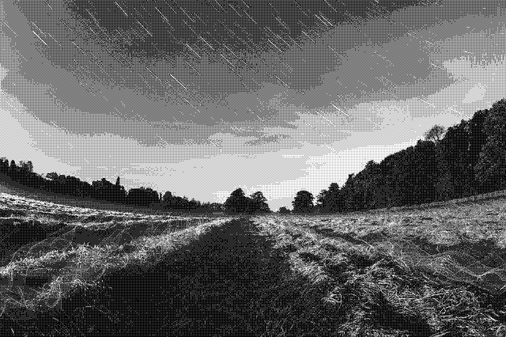
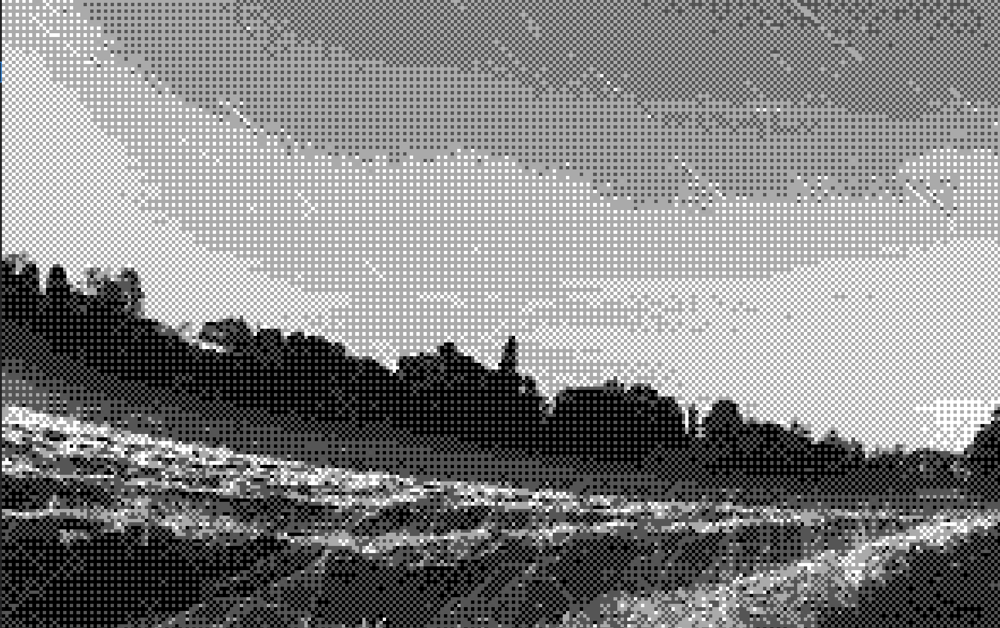

# Homework No.2

Student ID: 41047902S Name: 鄭淮薰

## Problem Statement

## (A) Dithering

Given a grayscale image I

1. Use the dithering matrix $D_2$ to generate an array D2 of image size by repeating
   
   $$
   D_2 = \begin{bmatrix}
0 & 128 & 32 & 160 \\
192 & 64 & 224 & 96 \\
48 & 176 & 16 & 144 \\
240 & 112 & 208 & 80 \\
\end{bmatrix}
   $$

2. Threshold image I by
   
   $$
   I'(i,j)= \begin{cases} 
255, & \text{if } I(i,j) > D(i,j)\\
0, & \text{if } I(i,j) \leq D(i,j)
\end{cases}
   $$

3. show image $I$ and $I'$

## (B) Extend to n = 4 gray values

1. $255 / 3 = 85$

2. $Q(i,j)=[I(i,j)/85]$

3. $$
   D_2 = \begin{bmatrix}
0 & 128 \\
192 & 64 \
\end{bmatrix} \rightarrow \text{extend to D}
   $$

4. $$
   I'(i,j) = Q(i,j) + \begin{cases} 
1, & \text{if } I(i,j)-85Q(i,j) > D(i,j)\\
0, & \text{if } I(i,j)-85Q(i,j) \leq D(i,j)
\end{cases}
   $$

5. Scale values of so that its values are in [0, 255] for displaying

## Input / Output

Using python to run this program, and here are some parameters user can use to specify the input and output

```shell
usage: hw2A.py [-h] [-i IMAGE] [-o OUTPUT] [-t TYPE]
options:
  -h,        --help           | show this help message and exit
  -i IMAGE,  --image IMAGE    | path to the image
  -o OUTPUT, --output OUTPUT  | name of the output image
  -t TYPE,   --type           | TYPE  type of the output image
```

## Test Results

```textile
Note：The images in the table are relatively small, making it difficult to discern differences.
```

Test case 1 utilizes JPG image files for testing. Fig1.1 represents a grayscale image, Fig1.2 displays the result of dithering the image, and Fig1.3 shows the extended version.

| Input                        | (A) Dithering                        | (B) Extend                          |
|:----------------------------:|:------------------------------------:|:-----------------------------------:|
|  |         |         |
| Fig1.1                       | Fig1.2                               | Fig1.3                              |
|    |  |  |
| Fig1.1 (enlarged)            | Fig1.1 (enlarged)                    | Fig1.1 (enlarged)                   |

---

Test case 2 utilizes JPG image files for testing. Fig2.1 represents a grayscale image, Fig2.2 displays the result of dithering the image, and Fig2.3 shows the extended version.

| Input                       | (A) Dithering                        | (B) Extend                          |
|:---------------------------:|:------------------------------------:|:-----------------------------------:|
|  |          |          |
| Fig2.1                      | Fig2.2                               | Fig2.3                              |
|   |  |  |
| Fig2.1 (enlarged)           | Fig2.1 (enlarged)                    | Fig2.1 (enlarged)                   |

---

Test case 3 utilizes BMP image files for testing. Fig3.1 represents a grayscale image, Fig3.2 displays the result of dithering the image, and Fig3.3 shows the extended version.

| Input                                                                          | (A) Dithering                                                                   | (B) Extend                          |
|:------------------------------------------------------------------------------:|:-------------------------------------------------------------------------------:|:-----------------------------------:|
|  |  |          |
| Fig3.1                                                                         | Fig3.2                                                                          | Fig3.3                              |
|                                                      |                                             |  |
| Fig3.1 (enlarged)                                                              | Fig3.1 (enlarged)                                                               | Fig3.1 (enlarged)                   |

## Comment

在這次的作業中，我運用 OpenCV 來處理不同格式的圖像。然而，由於圖片大小未必能恰好被矩陣 $D1$ 或 $D2$ 所填滿，因此我先將矩陣擴展至比圖片大一些的尺寸，再取出圖片的大小作為矩陣 $D$ 的大小進行處理。為實現矩陣的擴展，我使用 numpy 套件中的 tile 方法，將矩陣擴展至 $\lfloor \frac{width}{ndim} \rfloor+1$ x $\lfloor \frac{length}{ndim} \rfloor+1$ 的尺寸。

透過兩次的實驗，我更加深入了解 Dithering 的過程。比較兩次的輸出後，我發現圖片的品質確實如同教科書所述，灰階層數越多，圖片的品質也會越好。
